# Arquitetura

## Papéis

| Peça | Onde roda | Função |
| --- | --- | --- |
| Coletor | Mac (Fastify (Node 22)) ou Docker | Tokens, APIs, `GET /events` + `GET /usage` + Swagger `/docs` |
| Frontend | Vite (`:5173`) ou estático no coletor | Mostrador `/display` e configs `/display/config` |
| Firmware | ESP32 | Wi-Fi, SSE, desenho TFT |
| Wokwi | Simulador | Mesmo sketch, Wi-Fi simulada (`WOKWI_SIM`) até o coletor no Mac |
| wokwigw | Gateway local (Mac) | Ponte entre a rede Wi-Fi simulada do Wokwi e a LAN real, porta 9011 |

## Diagrama

```mermaid
flowchart TB
    subgraph Host["Host Mac — mesma LAN da placa"]
        subgraph Credenciais["Credenciais locais — nunca saem do host"]
            C1["Claude Code<br/>Keychain / ~/.claude/.credentials.json"]
            C2["Codex<br/>~/.codex/auth.json"]
            C3["Cursor<br/>state.vscdb SQLite"]
            C4["backend/data/config.json<br/>gitignored<br/>OpenRouter / DeepSeek / fal.ai / Bitcoin / AdSense"]
        end

        subgraph Coletor["Coletor Fastify (Node 22) :8787<br/>backend/src/main.ts + hub.ts"]
            Hub["UsageHub<br/>1 ciclo a cada USAGE_INTERVAL_S=60s<br/>RefreshCache por provedor"]
            Providers["providers/<br/>claude.ts / gpt.ts / cursor.ts<br/>openrouter.ts / deepseek.ts / opencode_*.ts<br/>fal.ts / bitcoin.ts / adsense.ts<br/>currencies + CoinGecko TTL 5min"]
            Hub --> Providers
        end

        Credenciais --> Providers

        subgraph Endpoints["Endpoints JSON sem Bearer — CONTRATO_JSON.md / schemas/ (Zod)"]
            E1["GET /events<br/>SSE — stream a cada 60s<br/>last-good"]
            E2["GET /usage<br/>força ciclo cotas"]
            E3["GET /docs<br/>Swagger"]
            E4["/api/config /api/alarms /api/telegram"]
        end
        Hub --> E1 & E2
        Coletor --- E4
    end

    subgraph LAN["LAN Wi-Fi — 0.0.0.0:8787"]
        E1 -. SSE .-> FW
        E1 -. SSE .-> WEB
        E2 -. poll .-> FW
        E2 -. poll .-> WEB
    end

    subgraph Frontend["Frontend Vite :5173 → prod em /display<br/>frontend/src/pages/Display.tsx"]
        WEB["/display — mostrador<br/>/display/config — contas<br/>/display/theme + /display/alarms<br/>React + TS + SSE"]
    end

    subgraph Firmware["Firmware ESP32 — firmware/src/main.cpp"]
        FW["ESP32 Dev Module<br/>TFT 3.5 ILI9488 320×480 SPI<br/>Touch XPT2046 CS=21 / Wokwi FT6206<br/>net/client.cpp + parse.cpp + ui/"]
        TFT["TFT Touch<br/>grade 2×3 / lista / detalhe paginado<br/>GPIO 2=TFT_DC"]
        FW --> TFT
    end

    subgraph Wokwi["Simulador — WOKWI_SIM"]
        WOK["Wokwi ILI9341 240×320<br/>Wi-Fi simulada"]
        GW["wokwigw ws://localhost:9011<br/>host.wokwi.internal → Mac localhost"]
        WOK --- GW --- Coletor
    end
```

> Fluxo: app oficial grava token no host → coletor lê (`backend/src/local/*`) e faz `Authorization: Bearer` nas APIs não-oficiais → `UsageHub` monta 1 snapshot (cada provedor com TTL próprio em `backend/src/refreshCache.ts`) e empurra via `GET /events` SSE — placa + N abas não multiplicam chamadas. `GET /usage` força ciclo extra só de cotas. Ver [`CONTRATO_JSON.md`](CONTRATO_JSON.md) e [`SETUP.md`](SETUP.md#como-o-vigia-lê-as-cotas).

## Fluxo (hardware)

1. Usuário inicia `./dev up` no Mac (mesma LAN da ESP32) e abre as configs em `http://127.0.0.1:5173/display/config`.
2. Coletor monta o snapshot a cada ciclo do hub (`USAGE_INTERVAL_S`, padrão 60 s) e empurra o JSON por `GET /events`. Cada API de terceiro tem o próprio TTL. `GET /usage` força um ciclo das cotas de assinatura.
3. ESP32 conecta no Wi-Fi, abre SSE em `/events` (a partir de `USAGE_URL`), parseia JSON, redesenha.
4. O intervalo real das APIs é o ciclo do coletor, não o poll de cada cliente. Falha de um provedor não apaga o outro se o JSON ainda trouxer o campo.

## Fluxo (Wokwi)

O simulador roda a **mesma** lógica de rede do hardware (`WOKWI_SIM`). Para o ESP32 simulado alcançar o coletor:

1. `wokwi.toml` aponta `[net] gateway = "ws://localhost:9011"` — sem isso o simulador usaria a rede simulada padrão da Wokwi (sem saída pra LAN local).
2. `.tools/wokwigw` (binário do [Wokwi IoT Gateway](https://github.com/wokwi/wokwigw)) precisa estar rodando, escutando em `ws://localhost:9011`.
3. Com o gateway de pé, `host.wokwi.internal` dentro do simulador resolve para o `localhost` do Mac — por isso `USAGE_URL` do env `wokwi` é `http://host.wokwi.internal:8787/usage`.

`./dev wokwi` na raiz do repo sobe o coletor **e** o `wokwigw` juntos (ver [FIRMWARE.md](FIRMWARE.md)).

## Confiança e rede

- Tokens **só no Mac** (arquivos oficiais do app ou `backend/data/config.json`).
- JSON na LAN contém percentuais e datas, **não** o Bearer.
- Bind padrão `0.0.0.0:8787` para a ESP32 alcançar. Não expor a porta na internet (sem túnel, sem port forward).
- Coletor não autenticado na LAN de casa: aceitável para v1. Quem estiver no Wi-Fi vê as cotas.

## Por que não chamar as APIs na ESP32

- TLS + JWT grandes + SQLite + OAuth no ESP32 é frágil.
- Tokens no flash da placa são extraíveis.
- Trocar parser quando a API muda é mais fácil no coletor (TypeScript/Node.js) do que no firmware.

## Dois firmwares, um sketch

`firmware/platformio.ini` define flags. `firmware/src/main.cpp` é único:

- `esp32dev`: ILI9488 320×480, Wi-Fi real
- `wokwi`: ILI9341 240×320, Wi-Fi simulada + coletor real via `wokwigw`
