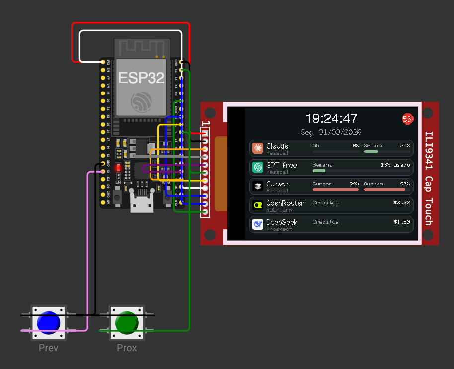
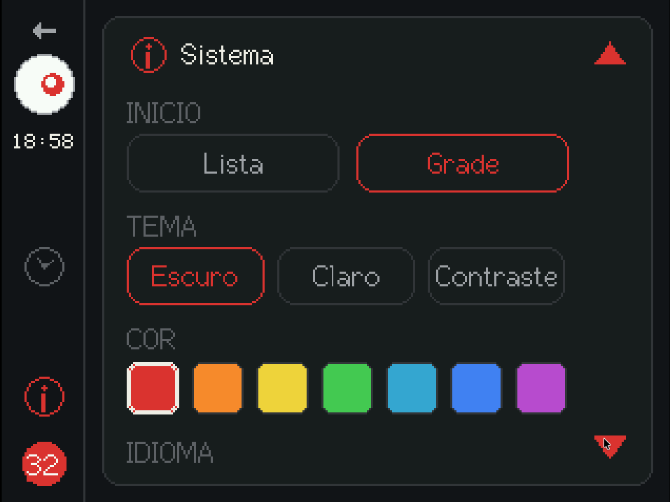
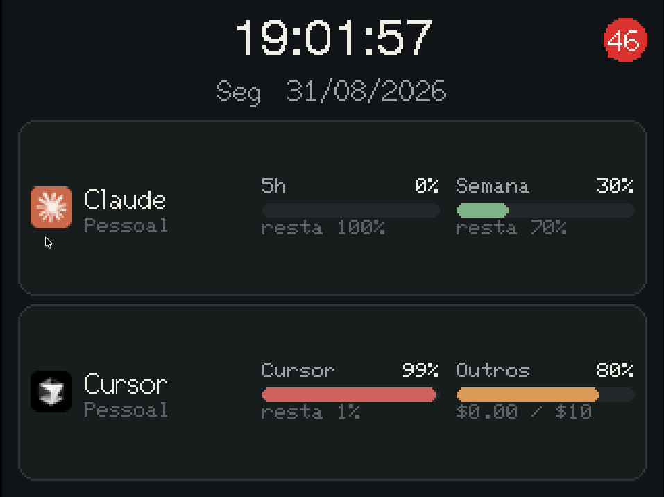
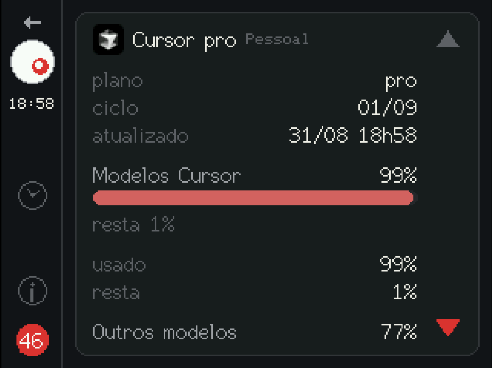
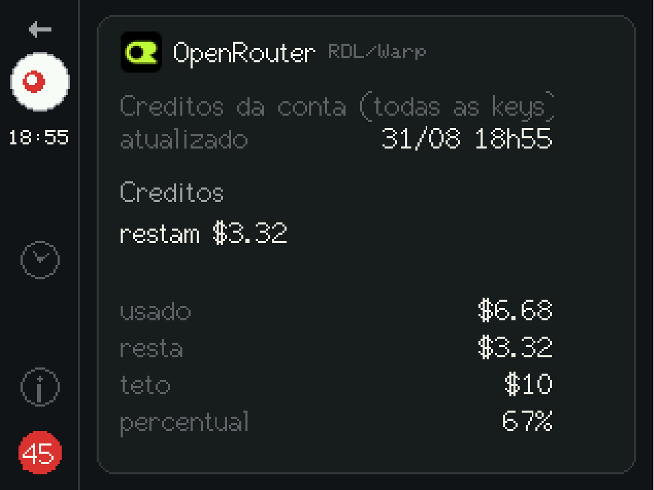
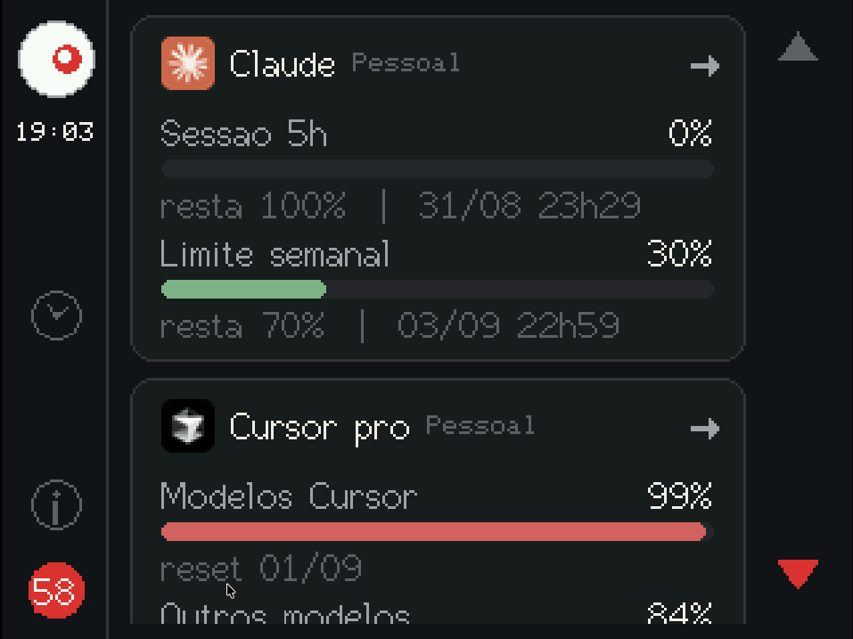
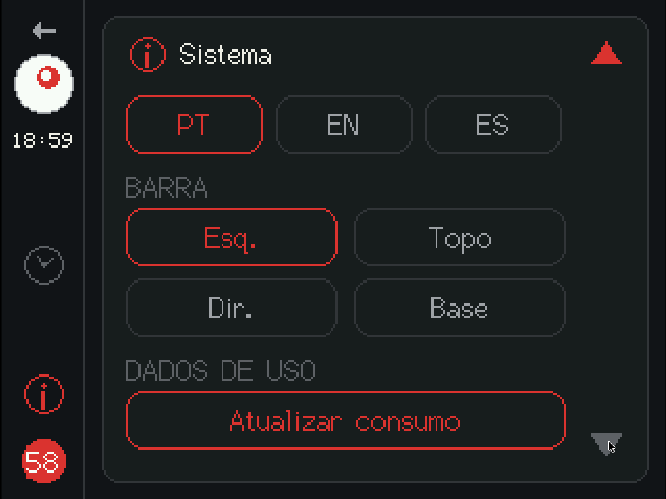
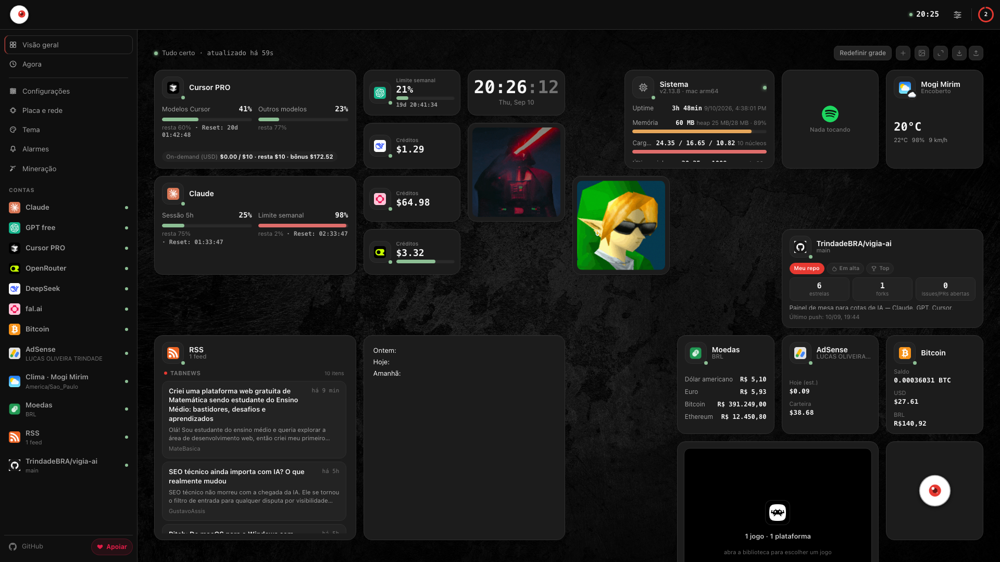
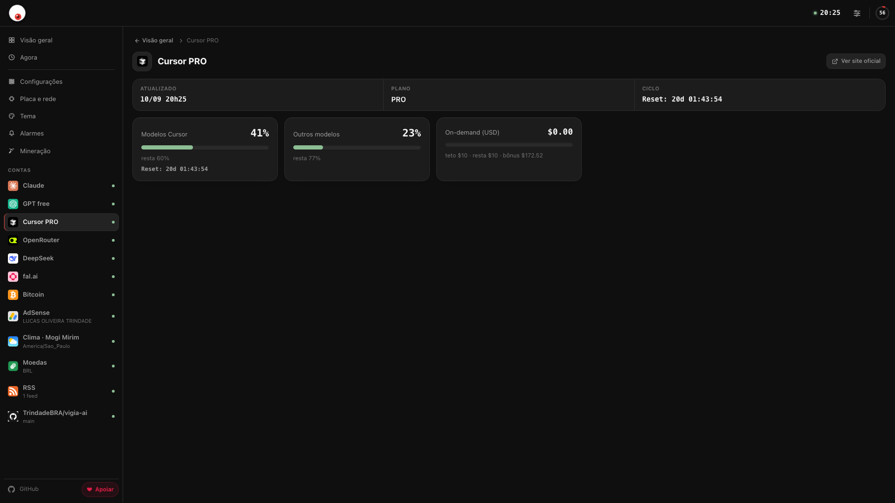

<div align="center">


# Vigia AI

### Painel de mesa para cotas de IA — sem nunca expor um token

**Claude** · **GPT** (ChatGPT / Codex) · **Cursor** · **OpenRouter** · **DeepSeek** · **OpenCode Go** · **OpenCode Zen** · **fal.ai**
rodando em **ESP32 + TFT 3,5" touch** (ou no navegador)

[](LICENSE)
[](backend)
[](frontend)
[](backend)
[](frontend)
[](firmware)
[](docs/HARDWARE.md)

<br>



<br><br>

<table>
<tr>
<td></td>
<td></td>
<td></td>
</tr>
</table>
</div>

## O problema

Eu uso Claude, ChatGPT/Codex, Cursor, OpenRouter, DeepSeek, OpenCode Go, OpenCode Zen e fal.ai no mesmo dia de trabalho — cada um com sua própria cota, sua própria janela de reset e sua própria aba pra checar. Na prática, eu só descobria que tinha estourado o limite do Cursor quando o autocomplete parava de responder no meio de uma tarefa.

O **Vigia AI** tira essa pergunta da cabeça: um mostrador sempre ligado na mesa, com o consumo de todas as contas atualizado sozinho. Sem abrir aba, sem rodar `curl`, sem lembrar de conferir.

## Onde roda

Um gadget físico de mesa — do tamanho de um despertador — mas o firmware é **opcional**: o mesmo painel roda como página web, então dá pra usar num monitor extra, no celular, ou sem ter a placa em mãos.

|                |                                                                                                        |
| -------------- | ------------------------------------------------------------------------------------------------------ |
| 🖥️ **Físico**   | ESP32 Dev Module + TFT SPI **3,5"** touch (XPT2046), tela sempre ligada na mesa                        |
| 🌐 **Web**      | [`/display`](docs/SETUP.md), mesmo layout, responsivo (desktop e mobile), tema/cor salvos no navegador |
| 🧪 **Simulado** | [Wokwi](https://wokwi.com/) no VS Code — testa o firmware sem soldar nada                              |

> [!WARNING]
> **LAN only.** Os endpoints de cota do Claude, do GPT e do Cursor **não são API pública** — são os mesmos que o CLI/IDE já usam neste computador. **Não exponha a porta 8787 na internet.** A placa **nunca** guarda tokens — só percentuais e datas. Detalhes em [Privacidade e segurança](#privacidade-e-segurança).

## Recursos

- **8 provedores, múltiplas contas cada** — Claude, GPT (ChatGPT/Codex), Cursor, OpenRouter, DeepSeek, OpenCode Go, OpenCode Zen, fal.ai
- **Tempo real** — um único ciclo de consulta no coletor, distribuído por SSE; placa e abas de `/display` não multiplicam chamadas
- **Zero tokens expostos** — a placa e o navegador só veem percentuais, datas e `ok: true/false`
- **Touch nativo** — grade ou lista na Início, detalhe por conta, configurações direto na tela
- **Alarmes + notificações push** — avise quando uma cota passar de um limiar ou o saldo de créditos ficar baixo, direto no navegador (Web Push/VAPID); ver [`docs/NOTIFICACOES.md`](docs/NOTIFICACOES.md)
- **3 temas × 7 cores de destaque**, **PT / EN / ES**
- **QR code na tela** — abre o painel de configuração de qualquer aparelho na mesma Wi-Fi
- **Resiliente** — falha numa conta (`ok: false`) nunca derruba as outras

## Capturas de tela

### Firmware (ESP32 + TFT 3,5")

Telas reais do firmware (touch XPT2046, tema **Escuro** com destaque vermelho). Toque em qualquer card para abrir o detalhe da conta; deslize para ver mais.

<table>
<tr>
<th align="center">Início — grade</th>
<th align="center">Início — lista</th>
<th align="center">Início — lista expandida</th>
</tr>
<tr>
<td></td>
<td></td>
<td></td>
</tr>
<tr>
<th align="center">Detalhe — Claude</th>
<th align="center">Detalhe — Cursor</th>
<th align="center">Detalhe — OpenRouter</th>
</tr>
<tr>
<td></td>
<td></td>
<td></td>
</tr>
<tr>
<th align="center">Detalhes empilhados</th>
<th align="center">Sistema — rede e QR</th>
<th align="center">Sistema — tema e cor</th>
</tr>
<tr>
<td></td>
<td></td>
<td></td>
</tr>
</table>

<div align="center">

<br><sub>Sistema — idioma, posição da barra e atualização manual</sub>
</div>

### Web (`/display` no navegador)

Mesmo contrato JSON, layout responsivo: sidebar no desktop, menu hambúrguer no celular. Tema, cor de destaque e idioma ficam salvos no navegador (`localStorage`).

<table>
<tr>
<th align="center">Visão geral (desktop)</th>
<th align="center">Detalhe — Cursor</th>
</tr>
<tr>
<td></td>
<td></td>
</tr>
<tr>
<th align="center">Agora (relógio + resumo)</th>
<th align="center">Aparência (tema e cor)</th>
</tr>
<tr>
<td></td>
<td></td>
</tr>
</table>

<table>
<tr>
<th align="center">Configurações (`/display/config`)</th>
<th align="center">Responsivo (mobile)</th>
</tr>
<tr>
<td></td>
<td></td>
</tr>
</table>

## Como funciona

```
Assinaturas (Claude / GPT / Cursor / OpenRouter / DeepSeek / OpenCode Go / OpenCode Zen / fal.ai)
        │  tokens só no host
        ▼
  backend FastAPI  :8787     GET /events  (SSE, JSON sem Bearer)
        │                    GET /usage   (consulta na hora)
        │                    GET /docs    (Swagger)
        ├──────────────────► ESP32 / Wokwi   (escuta o stream)
        └──────────────────► React            /display          réplica da placa
                                              /display/config   contas e placa
```

<div align="center">

</div>

1. Tokens ficam no computador (`Keychain`, `~/.codex/auth.json`, `state.vscdb`, ou `backend/data/config.json` gitignored) — o Vigia **reusa** o mesmo login que o Claude Code, o Codex ou o Cursor já fizeram, do mesmo jeito que esses apps fazem para desenhar a própria barra de uso.
2. O coletor consulta as APIs **uma vez por ciclo** (padrão 60 s) e empurra o mesmo JSON a todos os clientes SSE. `GET /usage` força um ciclo extra.
3. O JSON na LAN tem percentuais e datas, **nunca** o Bearer.
4. Falha de uma conta (`ok: false`) não derruba as outras. HTTP 200.

Quer entender exatamente como cada provedor é consultado (endpoints, headers, mapeamento de campos)? Guia técnico completo em [`docs/SETUP.md`](docs/SETUP.md#como-o-vigia-lê-as-cotas). Arquitetura: [`docs/ARQUITETURA.md`](docs/ARQUITETURA.md). Contrato da placa: [`docs/CONTRATO_JSON.md`](docs/CONTRATO_JSON.md).

## Privacidade e segurança

- O coletor **não é** um OAuth client: não emite, não autoriza e não renova tokens — só reusa o que o app oficial já gravou neste host.
- Token expirado numa conta vira `ok: false` **só naquela conta**; as outras continuam funcionando.
- O JSON público (`claude[]`, `gpt[]`, `cursor[]`, …) nunca carrega Bearer, Keychain, caminho do `auth.json` ou dump do SQLite — só `ok`, percentuais, resets e `plan`.
- Esses endpoints de cota **não são produto público**; podem mudar sem aviso, e a quebra fica isolada em `ok: false`.

> [!TIP]
> Se o app oficial não estiver neste computador (Docker, outro PC), dá pra colar o token manualmente no painel — é o plano B. Enquanto o Claude Code, o Codex ou o Cursor estiverem logados **aqui**, não precisa colar nada.

## Comece agora

Precisa de **Python ≥ 3.11**, **Node 20+** e, para o firmware, [PlatformIO Core](https://platformio.org/).

```bash
./dev up
```

Isso já sobe o coletor e o mostrador web em `http://127.0.0.1:8787/display`. Para gravar a placa física, simular no Wokwi, configurar provedores e ver todos os comandos disponíveis:

### 📖 [Guia completo de instalação e setup → `docs/SETUP.md`](docs/SETUP.md)

## Contribuir

[CONTRIBUTING.md](CONTRIBUTING.md) · [SECURITY.md](SECURITY.md) · [CODE_OF_CONDUCT.md](CODE_OF_CONDUCT.md) · [CHANGELOG.md](CHANGELOG.md)

Para agentes de IA: [`AGENTS.md`](AGENTS.md) e [`docs/CONTEXTO_IA.md`](docs/CONTEXTO_IA.md).

Licença [MIT](LICENSE).
