<div align="center">


# Vigia AI

### Painel de mesa para cotas de IA — sem nunca expor um token

**20+ integrações**: cotas de IA (**Claude**, **GPT**, **Cursor**, **OpenRouter**, **DeepSeek**, **OpenCode**, **fal.ai**), **Git/GitHub**, **Bitcoin**, **AdSense**, Moedas, Clima, Calendário, RSS, ISS, RetroAchievements, Spotify, YouTube Music, Câmera, Android, Emulador e Mineração Bitcoin —
rodando em **ESP32 + TFT 3,5" touch**, no navegador ou no **app desktop** (Mac/Linux/Windows)

[](LICENSE)
[](backend)
[](backend)
[](frontend)
[](firmware)
[](.agents/HARDWARE.md)

<br>

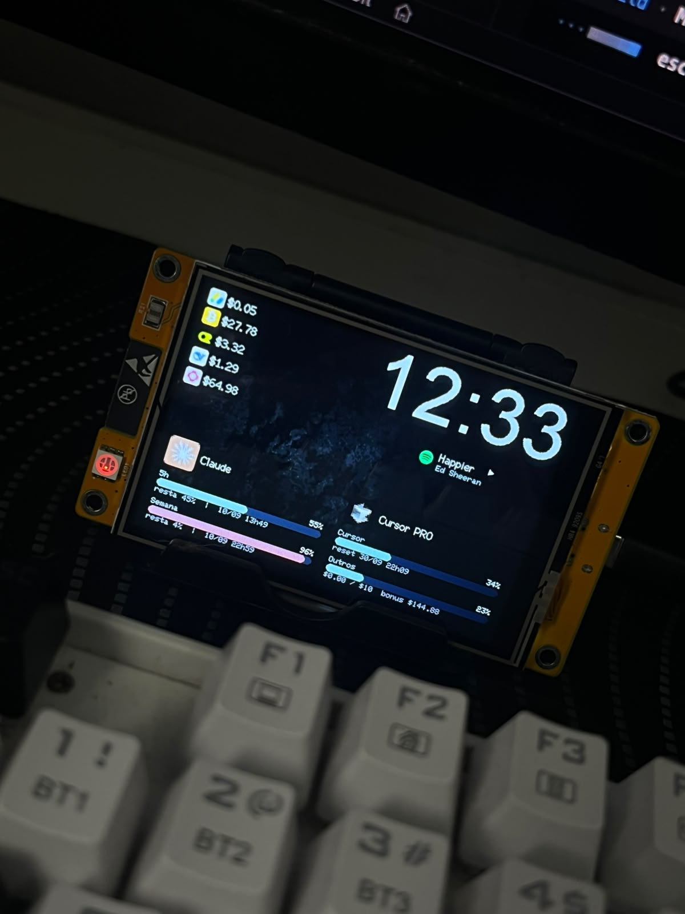

<br><br>


<br><br>

<table>
<tr>
<td>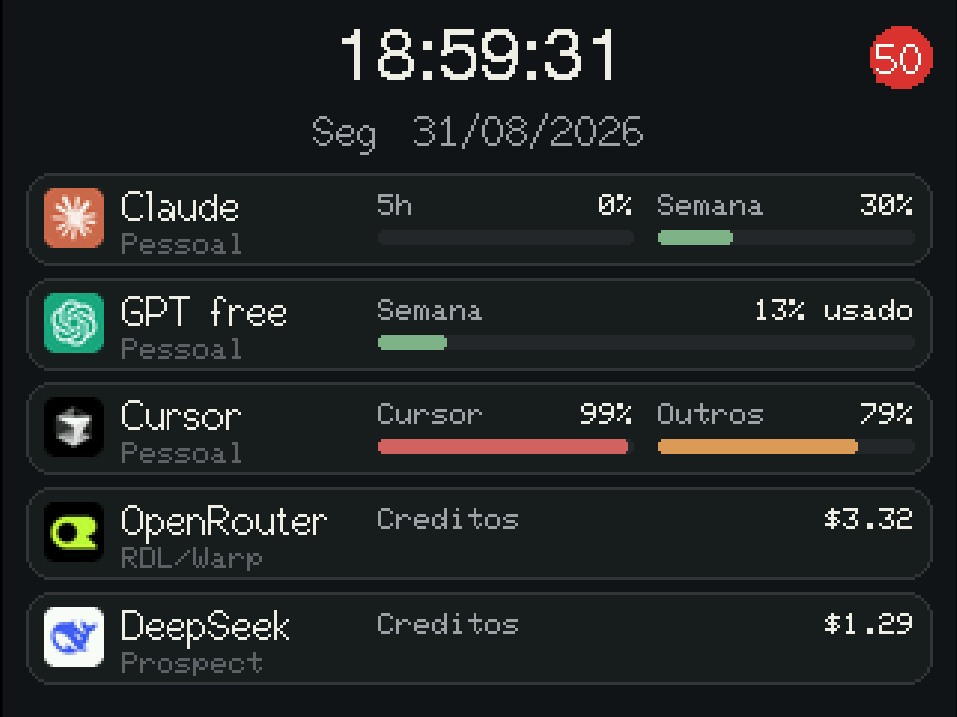</td>
<td>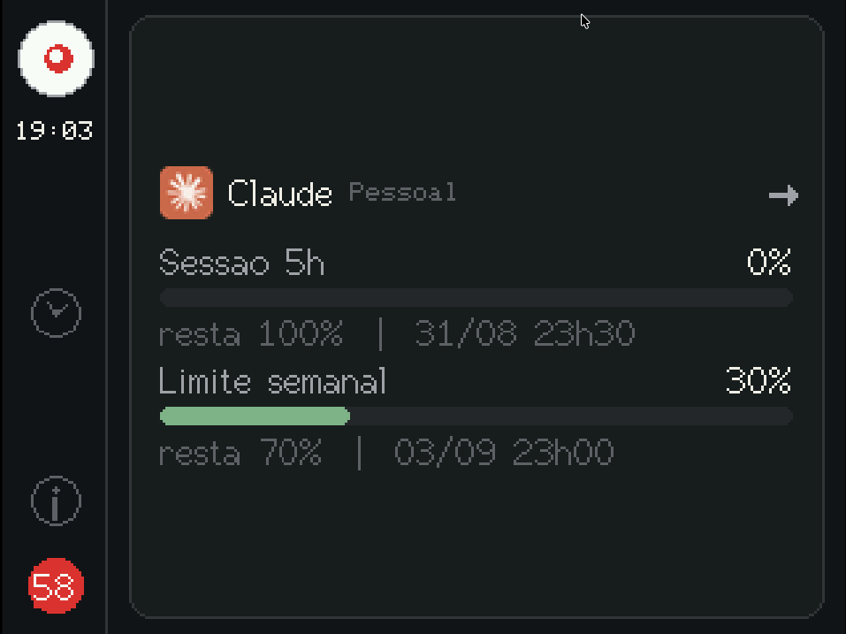</td>
<td></td>
</tr>
</table>
</div>

## O problema

Eu uso Claude, ChatGPT/Codex, Cursor, OpenRouter, DeepSeek, OpenCode Go, OpenCode Zen e fal.ai no mesmo dia de trabalho — cada um com sua própria cota, sua própria janela de reset e sua própria aba pra checar. Na prática, eu só descobria que tinha estourado o limite do Cursor quando o autocomplete parava de responder no meio de uma tarefa.

O **Vigia AI** tira essa pergunta da cabeça: um mostrador sempre ligado na mesa, com o consumo de todas as contas atualizado sozinho. Sem abrir aba, sem rodar `curl`, sem lembrar de conferir.

## Onde roda

Um gadget físico de mesa — do tamanho de um despertador — mas o firmware é **opcional**: o mesmo painel roda como página web, então dá pra usar num monitor extra, no celular, ou sem ter a placa em mãos.

|                |                                                                                                                             |
| -------------- | --------------------------------------------------------------------------------------------------------------------------- |
| 🖥️ **Físico**   | ESP32-2432 (ou Dev Module) + TFT SPI **3,5"** touch (XPT2046, `TOUCH_CS 33` na integrada), tela sempre ligada na mesa — ver [`firmware/README.md`](firmware/README.md) |
| 🌐 **Web**      | [`/display`](.agents/SETUP.md), mesmo layout, responsivo (desktop e mobile), tema/cor salvos no backend (`/api/prefs`)     |
| 💻 **App**      | Instalador para **Linux, macOS e Windows** — não precisa de Python nem de Node ([`.agents/DESKTOP.md`](.agents/DESKTOP.md)) |
| 🧪 **Simulado** | [Wokwi](https://wokwi.com/) no VS Code — testa o firmware sem soldar nada                                                   |

> [!WARNING]
> **LAN only.** Os endpoints de cota do Claude, do GPT e do Cursor **não são API pública** — são os mesmos que o CLI/IDE já usam neste computador. **Não exponha a porta 8787 na internet.** A placa **nunca** guarda tokens — só percentuais e datas. Detalhes em [Privacidade e segurança](#privacidade-e-segurança).

## Recursos

- **20+ integrações, múltiplas contas cada** — **Cotas de IA:** Claude, GPT (ChatGPT/Codex), Cursor, OpenRouter, DeepSeek, OpenCode Go/Zen, fal.ai · **Financeiro:** Bitcoin, AdSense, Moedas · **Dev:** Git, GitHub · **Vida:** RetroAchievements, Calendário ICS, RSS, Clima, ISS · **Mídia:** Spotify, YouTube Music · **Hardware:** Câmera (RTSP + ONVIF PTZ), Android (ADB), Emulador (EmulatorJS), Mineração Bitcoin, Sistema (CPU/RAM/disco)
- **Tempo real** — um único ciclo de consulta no coletor, distribuído por SSE; placa e abas de `/display` não multiplicam chamadas
- **Zero tokens expostos** — a placa e o navegador só veem percentuais, datas e `ok: true/false`
- **Touch nativo** — grade ou lista na Início, detalhe por conta, configurações direto na tela
- **Board arrastável no `/display` web** — vários tamanhos de card (do compacto ao super largo), arraste e redimensione, packing sem sobreposição; notas e imagens como post-its; layout sincroniza entre dispositivos na mesma LAN
- **Papéis de parede** — fundo do editor de tema e do board web com imagem própria (upload), busca em Pexels/Wallhaven/Unsplash/Giphy, ou **GIF animado** convertido em quadros direto pra ESP32
- **Alarmes + Telegram** — avise quando uma cota passar de um limiar ou o saldo de créditos ficar baixo, por mensagem no Telegram, com exportar/importar regras em JSON; ver [`.agents/NOTIFICACOES.md`](.agents/NOTIFICACOES.md)
- **Cotação de moedas e clima** — lista livre de moedas fiat/cripto convertidas numa moeda base, e previsão do tempo (Open-Meteo); cards opcionais na Início, Agora e detalhe
- **Flash e download de firmware pelo painel** — grava a ESP32 via USB e baixa o firmware da release atual direto em `/display/setup`, sem terminal
- **Command palette + suporte offline** — busca rápida por qualquer tela do painel; service worker mantém o `/display` web funcionando com a rede instável
- **3 temas × 7 cores de destaque**, **PT / EN / ES**
- **QR code na tela** — abre o painel de configuração de qualquer aparelho na mesma Wi-Fi
- **Resiliente** — falha numa conta (`ok: false`) nunca derruba as outras

## Capturas de tela

### Firmware (ESP32 + TFT 3,5")

Telas reais do firmware (touch XPT2046, tema **Escuro** com destaque vermelho). Toque em qualquer card para abrir o detalhe da conta; deslize para ver mais.

<table>
<tr>
<th align="center">Início — grade</th>
<th align="center">Início — lista</th>
<th align="center">Início — lista expandida</th>
</tr>
<tr>
<td>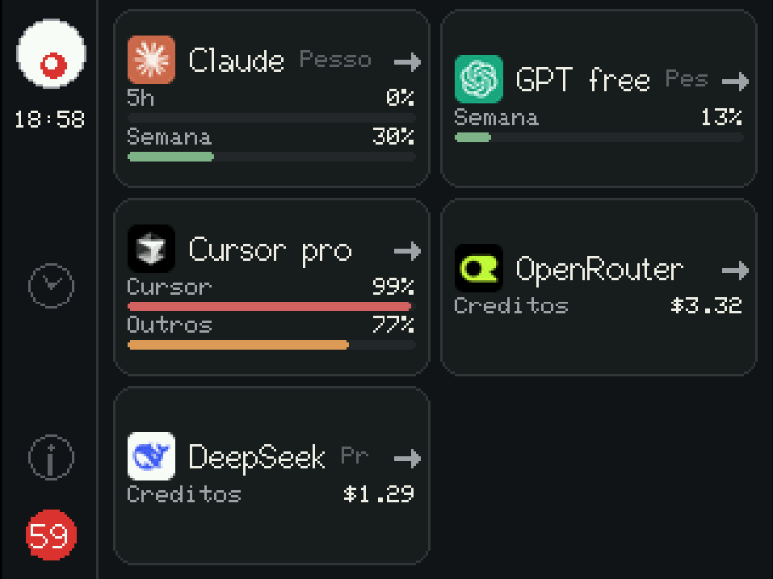</td>
<td></td>
<td></td>
</tr>
<tr>
<th align="center">Detalhe — Claude</th>
<th align="center">Detalhe — Cursor</th>
<th align="center">Detalhe — OpenRouter</th>
</tr>
<tr>
<td></td>
<td></td>
<td></td>
</tr>
<tr>
<th align="center">Detalhes empilhados</th>
<th align="center">Sistema — rede e QR</th>
<th align="center">Sistema — tema e cor</th>
</tr>
<tr>
<td></td>
<td>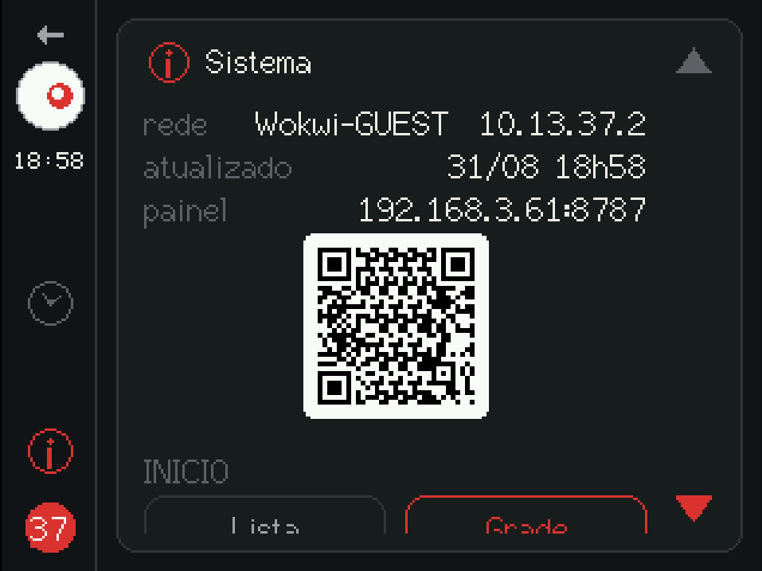</td>
<td></td>
</tr>
</table>

<div align="center">

<br><sub>Sistema — idioma, posição da barra e atualização manual</sub>
</div>

### Web (`/display` no navegador)

Mesmo contrato JSON, layout responsivo: sidebar no desktop, menu hambúrguer no celular. Tema, cor de destaque e idioma ficam salvos no navegador (`localStorage`).

<table>
<tr>
<th align="center">Visão geral (desktop)</th>
<th align="center">Detalhe — Cursor</th>
</tr>
<tr>
<td></td>
<td></td>
</tr>
<tr>
<th align="center">Agora (relógio + resumo)</th>
<th align="center">Aparência (tema e cor)</th>
</tr>
<tr>
<td>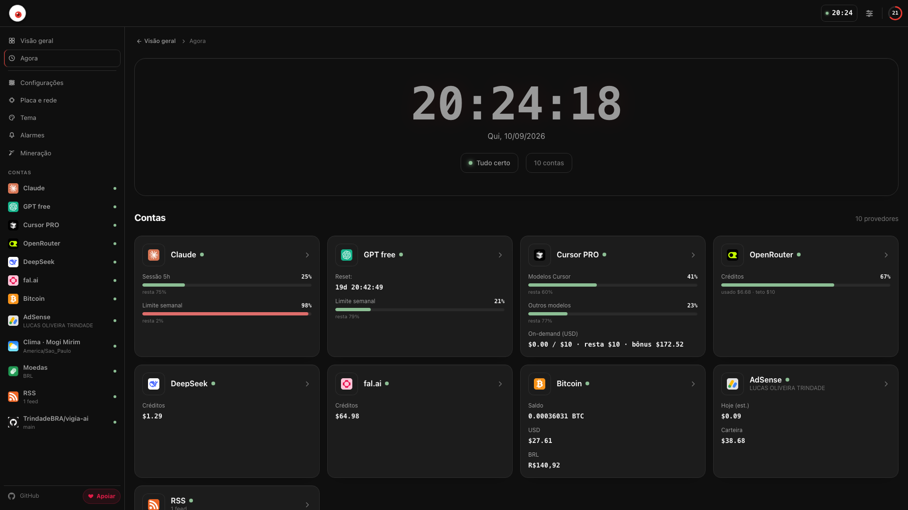</td>
<td>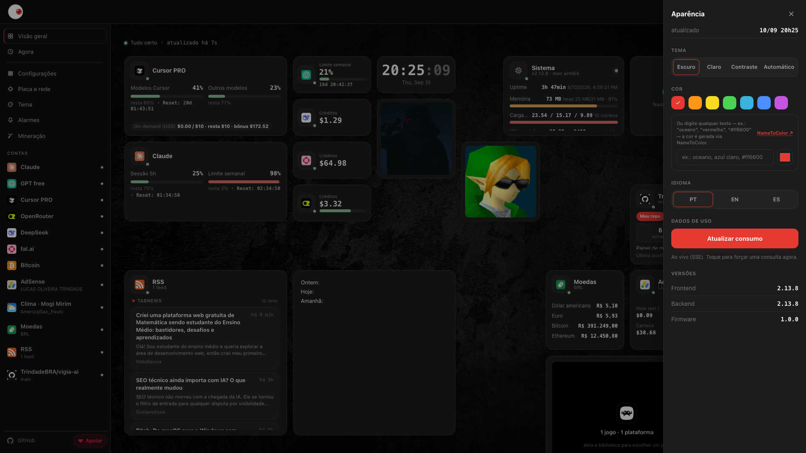</td>
</tr>
</table>

<table>
<tr>
<th align="center">Configurações (`/display/config`)</th>
<th align="center">Responsivo (mobile)</th>
</tr>
<tr>
<td>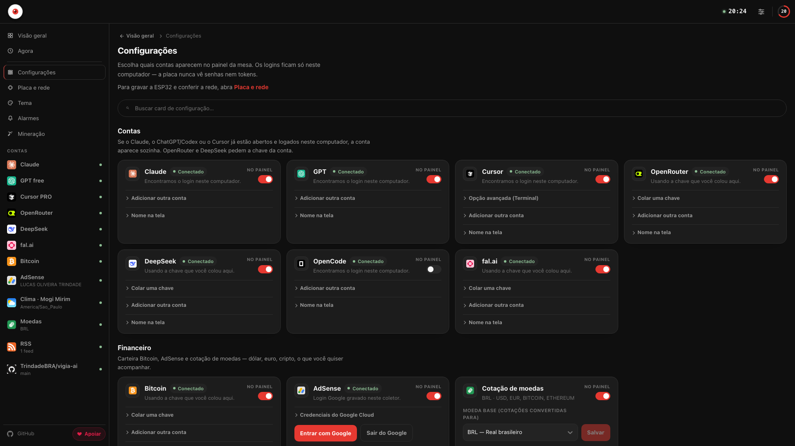</td>
<td>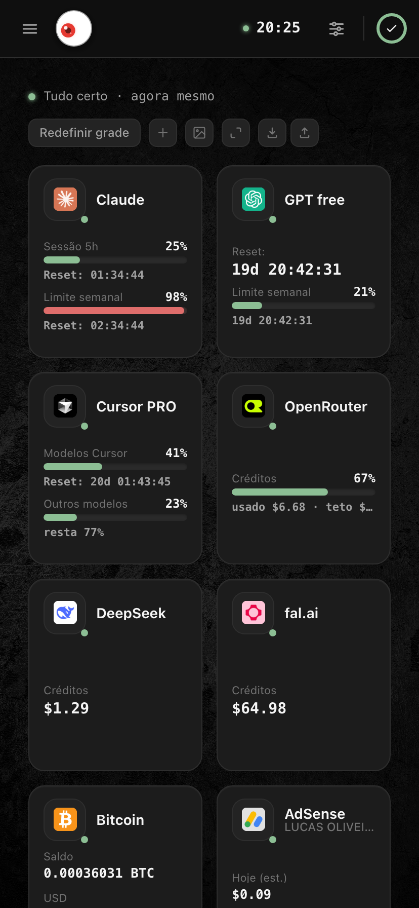</td>
</tr>
</table>

### Editor de tema (`/display/theme`)

Monta o fundo, o relógio e os ícones dos provedores livremente num canvas — cada ícone traz a cota ao vivo, escolhida por você. Salva no coletor; a placa aplica ao tocar em recarregar.

<table>
<tr>
<th align="center">Editor no painel web</th>
<th align="center">Tema aplicado na placa</th>
</tr>
<tr>
<td>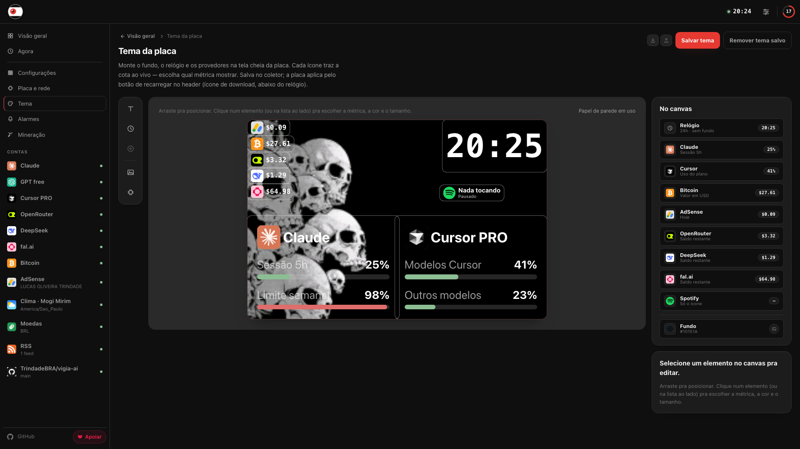</td>
<td>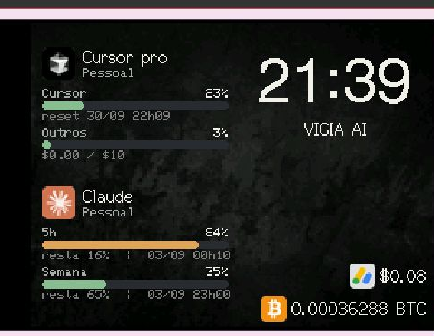</td>
</tr>
</table>

## Como funciona

```
Assinaturas (Claude / GPT / Cursor / OpenRouter / DeepSeek / OpenCode Go / OpenCode Zen / fal.ai / Bitcoin / AdSense)
        │  tokens só no host
        ▼
  backend Node + Fastify :8787  GET /events  (SSE, JSON sem Bearer)
        │                       GET /usage   (consulta na hora)
        │                       GET /docs    (Swagger)
        │                       /api/alarms + /api/telegram  (alarmes → Telegram)
        ├──────────────────► ESP32 / Wokwi   (escuta o stream)
        └──────────────────► React            /display          réplica da placa
                                                  /display/config   contas e placa
                                                  /display/alarms   alarmes + Telegram
```

<div align="center">

</div>

1. Tokens ficam no computador (`Keychain`, `~/.codex/auth.json`, `state.vscdb`, ou `backend/data/config.json` gitignored) — o Vigia **reusa** o mesmo login que o Claude Code, o Codex ou o Cursor já fizeram, do mesmo jeito que esses apps fazem para desenhar a própria barra de uso.
2. O coletor consulta as APIs **uma vez por ciclo** (padrão 60 s) e empurra o mesmo JSON a todos os clientes SSE. `GET /usage` força um ciclo extra.
3. O JSON na LAN tem percentuais e datas, **nunca** o Bearer.
4. Falha de uma conta (`ok: false`) não derruba as outras. HTTP 200.

Quer entender exatamente como cada provedor é consultado (endpoints, headers, mapeamento de campos)? Guia técnico completo em [`.agents/SETUP.md`](.agents/SETUP.md#como-o-vigia-lê-as-cotas). Arquitetura: [`.agents/ARQUITETURA.md`](.agents/ARQUITETURA.md). Contrato da placa: [`.agents/CONTRATO_JSON.md`](.agents/CONTRATO_JSON.md).

### Frequência de requisições

Cada card do `/display` faz seu próprio poll em background (`fetch` direto
no componente ou hook — não passa por um client HTTP centralizado):

| Serviço | Intervalo | Onde |
| --- | --- | --- |
| Contas (Claude/GPT/Cursor/OpenRouter/DeepSeek/Bitcoin/AdSense…) | SSE (push) + poll de 60 s como fallback | `/display` |
| Spotify | 15 s | `/display` |
| YouTube Music | 15 s | `/display` |
| Sistema (CPU/RAM/disco) | 10 s | `/display` |
| Notas | 15 s | `/display` |
| Widgets de imagem | 15 s | `/display` |
| Dispositivos Android | 15 s | `/display` |
| Câmeras (listagem) | 60 s | `/display` |
| Mineração — status | 5 s | só em `/display/config` (aba de mineração aberta) |
| Telegram | 3 s | só em `/display/config`, e só enquanto o bot está configurado mas ainda sem chat vinculado |

## Privacidade e segurança

- O coletor **não é** um OAuth client: não emite, não autoriza e não renova tokens — só reusa o que o app oficial já gravou neste host.
- Token expirado numa conta vira `ok: false` **só naquela conta**; as outras continuam funcionando.
- O JSON público (`claude[]`, `gpt[]`, `cursor[]`, …) nunca carrega Bearer, Keychain, caminho do `auth.json` ou dump do SQLite — só `ok`, percentuais, resets e `plan`.
- Esses endpoints de cota **não são produto público**; podem mudar sem aviso, e a quebra fica isolada em `ok: false`.

> [!TIP]
> Se o app oficial não estiver neste computador (Docker, outro PC), dá pra colar o token manualmente no painel — é o plano B. Enquanto o Claude Code, o Codex ou o Cursor estiverem logados **aqui**, não precisa colar nada.

## Comece agora

### Como aplicativo

**macOS, via Homebrew (recomendado)** — instala sem o aviso de "app danificado" do Gatekeeper (veja o porquê logo abaixo):

```bash
brew tap TrindadeBRA/vigia-ai
brew install --cask vigia-ai
```

Pra atualizar depois (o `brew update` é necessário pra buscar a versão nova da tap — sem ele o `upgrade` acha que já está tudo atualizado):

```bash
brew update
brew upgrade --cask vigia-ai
```

**Linux — um comando (recomendado):**

```bash
curl -fsSL https://raw.githubusercontent.com/TrindadeBRA/vigia-ai/main/install.sh | bash
```

Baixa o `.tar.gz` do [latest release](https://github.com/TrindadeBRA/vigia-ai/releases/latest), pergunta se instala só para você (`~/.local/share/vigia-ai`, sem sudo) ou para todos (`/opt/vigia-ai`, pede senha do sudo), extrai, cria o atalho `.desktop` com o ícone de olho e o comando `vigia-ai` no PATH. Variações:

```bash
curl -fsSL https://raw.githubusercontent.com/TrindadeBRA/vigia-ai/main/install.sh | bash -s -- --user      # só para você
curl -fsSL https://raw.githubusercontent.com/TrindadeBRA/vigia-ai/main/install.sh | bash -s -- --system    # para todos (sudo)
curl -fsSL https://raw.githubusercontent.com/TrindadeBRA/vigia-ai/main/install.sh | bash -s -- --uninstall # remover
```

**Ou baixe direto**: instalador da sua plataforma nos [releases](https://github.com/TrindadeBRA/vigia-ai/releases) — `.dmg` (macOS), `.exe` (Windows), `.AppImage`, `.deb` ou `.tar.gz` (Linux). **Não precisa instalar Python nem Node**: o coletor vai embarcado.

O app é o mesmo produto: continua servindo `/display` na rede local para a ESP32 e para o navegador, e o menu tem **Abrir no navegador** quando você preferir uma aba. Detalhes em [`.agents/DESKTOP.md`](.agents/DESKTOP.md).

> [!IMPORTANT]
> **macOS: "Vigia AI está danificado e não pode ser aberto"** — só acontece baixando o `.dmg` direto (não pelo Homebrew). O app não está corrompido: não temos certificado pago da Apple (Developer ID) pra assinar/notarizar o build, e o macOS marca todo download da internet sem essa assinatura como "danificado", mesmo íntegro. Três saídas: **(1)** instalar via Homebrew (comando acima, resolve sozinho); **(2)** o `.dmg` já vem com um `fix-gatekeeper.command` — dê dois cliques nele (depois de arrastar o app pra Applications) e abra o Vigia AI normalmente; **(3)** via Terminal: `xattr -cr "/Applications/Vigia AI.app"`.
>
> **Windows: "O Windows protegeu o computador"** — mesmo motivo do macOS: o instalador (`.exe`, NSIS) não tem certificado Authenticode pago, e o SmartScreen desconfia de qualquer app novo sem assinatura. Clique em **"Mais informações"** → **"Executar assim mesmo"**. O código é aberto, dá pra conferir tudo no repositório antes de rodar.

### A partir do código

Precisa de **Node 22 LTS** e, para o firmware, [PlatformIO Core](https://platformio.org/).

```bash
./dev up      # coletor + painel web
./dev app     # o mesmo, dentro do app desktop
```

Isso já sobe o coletor (`:8788` em dev) e o mostrador web em `http://127.0.0.1:5173/display`. Para gravar a placa física, simular no Wokwi, configurar provedores e ver todos os comandos disponíveis:

### 📖 [Guia completo de instalação e setup → `.agents/SETUP.md`](.agents/SETUP.md)

## Contribuir

[CONTRIBUTING.md](CONTRIBUTING.md) · [SECURITY.md](SECURITY.md) · [CODE_OF_CONDUCT.md](CODE_OF_CONDUCT.md) · [CHANGELOG.md](CHANGELOG.md)

Para agentes de IA: [`AGENTS.md`](AGENTS.md) e [`.agents/CONTEXTO_IA.md`](.agents/CONTEXTO_IA.md).

Licença [MIT](LICENSE).
